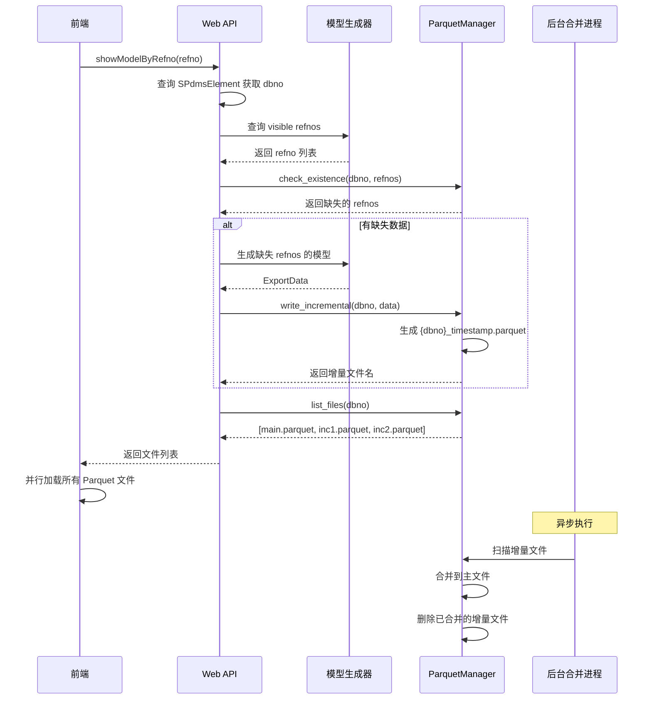

# 增量 Parquet 生成与合并方案

## 方案概述

### 背景

当前实现使用单一 `{dbno}.parquet` 文件存储模型实例数据，每次新增数据时采用 Read-Merge-Write 模式。这种方式在高并发场景下存在性能瓶颈和文件锁竞争问题。

### 核心思路

采用**主文件 + 临时增量文件 + 异步合并**的架构：

1. **主文件**：`{dbno}.parquet` - 存储已合并的完整数据
2. **增量文件**：`{dbno}_YYYYMMDD_HHMMSS.parquet` - 按时间戳命名的临时增量数据
3. **后台合并**：独立进程异步合并增量文件到主文件
4. **联合加载**：前端同时加载主文件和未合并的增量文件

## 技术方案

### 1. 数据生成流程



### 2. 文件命名规范

```
output/database_models/
├── 1112.parquet                        # 主文件
├── 1112.manifest.json                  # 清单（一致性视图）
├── 1112_20251222_103045_001.parquet    # 增量文件 1
├── 1112_20251222_110521_002.parquet    # 增量文件 2
└── 17496.parquet                       # 另一个 dbno 的主文件
```

**命名格式**：
- 主文件：`{dbno}.parquet`
- 清单文件：`{dbno}.manifest.json`
- 增量文件：`{dbno}_YYYYMMDD_HHMMSS_{seq}.parquet`

#### 2.1 唯一性与排序

- **唯一性**：同一秒内可能并发写入，建议在时间戳后追加 `seq`（同秒自增）或 `pid/随机短串`，例如 `1112_20251222_103045_001.parquet`。
- **排序**：服务端返回增量文件时按 `{timestamp, seq}` 升序，前端后加载的增量自然覆盖旧数据。

#### 2.2 清单文件（manifest.json）

为保证**一致性视图**，每个 `dbno` 维护一份清单文件，作为前端加载与后台合并的单一事实来源（Single Source of Truth）。

**示例结构**：
```json
{
  "dbno": 1112,
  "snapshot_id": "2025-12-22T11:05:21Z-0003",
  "schema_version": 1,
  "main": {
    "filename": "1112.parquet",
    "rows": 123456,
    "sha256": "..."
  },
  "incrementals": [
    { "filename": "1112_20251222_103045_001.parquet", "rows": 120, "timestamp": "2025-12-22T10:30:45Z" },
    { "filename": "1112_20251222_110521_002.parquet", "rows": 86, "timestamp": "2025-12-22T11:05:21Z" }
  ],
  "updated_at": "2025-12-22T11:05:21Z"
}
```

**更新规则**：
- 清单写入采用**原子替换**（先写临时文件，再 rename）。
- `list_all_files` 直接读取清单，避免“合并过程中列表不一致”。
- 前端以 `snapshot_id` 作为一致性锚点；若文件 404 或 snapshot 变化，重新拉取清单。

### 3. 核心组件设计

#### 3.1 ParquetManager 扩展

```rust
impl ParquetManager {
    /// 检查指定 refnos 是否已在 Parquet 文件中存在
    pub fn check_existence(&self, dbno: u32, refnos: &[RefnoEnum]) 
        -> Result<Vec<RefnoEnum>> {
        // 1. 扫描主文件和所有增量文件
        // 2. 收集已存在的 refnos
        // 3. 返回缺失的 refnos
    }
    
    /// 写入增量 Parquet 文件
    pub fn write_incremental(&self, dbno: u32, data: &ExportData) 
        -> Result<String> {
        // 1. 生成时间戳文件名
        // 2. 直接写入（无需读取），避免锁竞争
        // 3. 返回增量文件名
    }
    
    /// 列出主文件和所有增量文件
    pub fn list_all_files(&self, dbno: u32) 
        -> Result<Vec<String>> {
        // 1. 读取 manifest.json 获取一致性视图
        // 2. 按 timestamp + seq 排序返回
    }
    
    /// 合并增量文件到主文件（后台进程调用）
    pub fn merge_incremental(&self, dbno: u32) 
        -> Result<usize> {
        // 1. 获取 merge 锁（避免并发合并）
        // 2. 读取 manifest 快照（snapshot_id）
        // 3. 读取主文件 + 增量文件（以 manifest 为准）
        // 4. 合并去重（基于 refno，增量优先）
        // 5. 写入新的主文件到临时文件
        // 6. fsync + 原子 rename 替换主文件
        // 7. 更新 manifest（清空已合并增量）
        // 8. 延迟删除增量文件
        // 9. 返回合并的记录数
    }
}
```

#### 3.2 后台合并进程

**选项 1：独立守护进程**
```rust
// bin/parquet_merger.rs
#[tokio::main]
async fn main() {
    let manager = ParquetManager::new("output");
    
    loop {
        // 扫描所有 dbno
        for dbno in manager.scan_dbnos()? {
            // 检查是否有增量文件
            if manager.has_incremental(dbno)? {
                // 执行合并
                match manager.merge_incremental(dbno) {
                    Ok(count) => info!("Merged {} records for dbno {}", count, dbno),
                    Err(e) => error!("Merge failed for dbno {}: {}", dbno, e),
                }
            }
        }
        
        // 间隔 5 分钟
        tokio::time::sleep(Duration::from_secs(300)).await;
    }
}
```

**选项 2：Web Server 内置后台任务**
```rust
// 在 web_server 启动时启动合并任务
tokio::spawn(async move {
    let manager = ParquetManager::new("output");
    periodic_merge_task(manager).await;
});
```

#### 3.3 API 响应结构

```rust
#[derive(Serialize)]
pub struct ShowByRefnoResponse {
    pub success: bool,
    pub message: String,
    pub metadata: Option<serde_json::Value>,
    // 新增：Parquet 文件列表
    pub parquet_files: Option<Vec<ParquetFileInfo>>,
    // 新增：一致性视图
    pub snapshot_id: Option<String>,
    pub manifest_url: Option<String>,
}

#[derive(Serialize)]
pub struct ParquetFileInfo {
    pub filename: String,
    pub url: String,
    pub file_type: ParquetFileType, // Main | Incremental
    pub timestamp: Option<String>,
}

#[derive(Serialize)]
pub enum ParquetFileType {
    Main,
    Incremental,
}
```

#### 3.4 并发与锁策略

- **写入锁**：`write_incremental` 只锁定“清单写入”步骤，避免阻塞并发生成。
- **合并锁**：`merge_incremental` 需要全局 merge 锁（每个 dbno 一把），避免并发合并。
- **重复生成防护**：可维护 `inflight_refnos`（内存或 Redis），对同一 refno 的并发生成做短时去重。

**推荐锁实现**：
- 文件锁：`{dbno}.merge.lock`（`flock` 或 `fs2::FileExt`）。
- 分布式锁（可选）：Redis `SETNX` + TTL。

#### 3.5 合并流程细节（原子替换）

1. 读取 manifest，记录 `snapshot_id` 与增量列表。
2. 合并完成后写入 `main.tmp.parquet`。
3. `fsync(main.tmp.parquet)` 后执行 `rename` 替换主文件。
4. 更新 `manifest.json`（新主文件 + 清空增量）。
5. 延迟删除增量文件（防止前端仍在读取时 404）。

### 4. 前端加载策略

```typescript
// useParquetModelLoader.ts
async function loadParquetToXeokit(
    viewer: Viewer,
    dbno: number,
    options?: LoadOptions
): Promise<LoadResult> {
    // 1. 获取 manifest（带 snapshot_id）
    const { files, snapshot_id } = await fetch(`/api/model/${dbno}/files`).then(r => r.json());
    
    // 2. 并行加载所有文件（按 manifest 顺序）
    const tables = await Promise.all(
        files.map(file => loadParquetFile(file.url))
    );
    
    // 3. 合并数据（前端去重）
    const allRows = tables.flatMap(t => parseTable(t));
    const uniqueRows = deduplicateByRefno(allRows);
    
    // 4. 按 geo_hash 分组并创建实例
    const grouped = groupByGeoHash(uniqueRows);
    
    // 5. 渲染到 xeokit
    return await renderToXeokit(viewer, grouped, options);
}

function deduplicateByRefno(rows: InstanceRow[]): InstanceRow[] {
    const map = new Map<string, InstanceRow>();
    // 后加载的文件优先（增量文件是最新的）
    for (const row of rows) {
        map.set(row.refno, row);
    }
    return Array.from(map.values());
}
```

**加载容错建议**：
- 某个增量文件 404：重新拉取 manifest 并重试。
- `snapshot_id` 变化：视为新版本，刷新文件列表。
- 缓存策略：manifest `Cache-Control: no-cache`，增量文件 `immutable, max-age=31536000`。

## 方案评估

### 优势

#### 1. 性能提升
- ✅ **避免读取锁**：增量写入无需读取主文件
- ✅ **快速响应**：新数据立即可用，不等待合并
- ✅ **并发友好**：多个请求可以同时生成不同的增量文件

#### 2. 稳定性
- ✅ **原子操作**：增量文件写入失败不影响主文件
- ✅ **容错性**：合并失败时数据仍可通过增量文件访问
- ✅ **可恢复**：进程崩溃后可继续未完成的合并

#### 3. 可维护性
- ✅ **职责分离**：生成、存储、合并各司其职
- ✅ **可观测**：增量文件数量反映系统负载
- ✅ **可调优**：合并频率、阈值可配置

### 挑战与解决方案

| 挑战 | 影响 | 解决方案 |
|------|------|----------|
| **前端加载多个文件** | 网络开销增加 | 1. HTTP/2 多路复用<br>2. 合并频率优化（减少文件数）<br>3. 前端缓存策略 |
| **数据一致性** | 可能读到旧数据 | 1. manifest 快照 + snapshot_id<br>2. 增量文件时间戳排序<br>3. 最新数据优先策略 |
| **文件列表不一致** | 合并中读到半更新列表 | 1. list_all_files 只读 manifest<br>2. manifest 原子替换 |
| **合并期间 404** | 客户端加载失败 | 1. 延迟删除增量文件<br>2. 404 时刷新 manifest |
| **重复生成** | 资源浪费 | 1. inflight_refnos 短时去重<br>2. 合并时 refno 去重 |
| **Schema 演进** | 解析失败 | 1. manifest.schema_version<br>2. 缺列默认值 |
| **合并复杂度** | 合并耗时长 | 1. 增量合并（批量处理）<br>2. 文件数阈值触发<br>3. 低峰期执行 |
| **孤儿文件** | 磁盘空间浪费 | 1. 定期清理检查<br>2. 文件过期时间（7天）<br>3. 健康检查脚本 |
| **并发合并冲突** | 数据损坏风险 | 1. 文件锁机制<br>2. 分布式锁（Redis）<br>3. 合并状态标记文件 |

### 性能对比

| 场景 | 当前方案 (Read-Merge-Write) | 新方案 (增量 + 合并) |
|------|----------------------------|---------------------|
| **首次生成** | ~500ms | ~100ms（仅写入） |
| **增量生成** | ~800ms（读+合并+写） | ~150ms（仅写入） |
| **并发生成** | 串行化，等待锁 | 并行，无锁竞争 |
| **加载时间** | ~200ms（单文件） | ~250ms（3个文件） |
| **磁盘占用** | 低（单文件） | 中（临时文件） |

## 实施计划

### Phase 1: 核心功能（1-2天）

- [ ] 扩展 `ParquetManager`
  - [ ] `check_existence` 实现
  - [ ] `write_incremental` 实现
  - [ ] `list_all_files` 实现
- [ ] 修改 `api_show_by_refno`
  - [ ] 查询 visible refnos
  - [ ] 检查数据存在性
  - [ ] 调用增量写入
- [ ] 更新 API 响应结构

### Phase 2: 前端适配（0.5天）

- [ ] 修改 `useParquetModelLoader`
  - [ ] 支持多文件加载
  - [ ] 实现前端去重逻辑
- [ ] 更新 `useModelGeneration`
  - [ ] 解析文件列表响应

### Phase 3: 后台合并（1-2天）

- [ ] 实现 `merge_incremental`
  - [ ] 文件锁机制
  - [ ] 原子替换逻辑
  - [ ] 错误恢复
- [ ] 后台合并进程
  - [ ] 定时扫描
  - [ ] 合并策略配置
  - [ ] 日志和监控

### Phase 4: 优化与测试（1天）

- [ ] 性能测试
  - [ ] 并发生成压测
  - [ ] 加载性能对比
- [ ] 容错测试
  - [ ] 合并失败场景
  - [ ] 进程崩溃恢复
- [ ] 孤儿文件清理脚本

## 配置参数

```toml
# DbOption.toml
[parquet]
# 增量文件数量阈值，超过后触发合并
incremental_threshold = 5

# 合并间隔（秒）
merge_interval = 300

# 增量文件过期时间（天），超过后自动清理
incremental_expire_days = 7

# 是否启用自动合并
auto_merge_enabled = true

# 合并时是否锁定写入（防止合并期间新增数据）
lock_on_merge = false

# 是否启用 manifest（推荐）
manifest_enabled = true

# 合并锁超时（秒）
merge_lock_timeout = 30

# 合并后延迟删除增量文件（秒）
merge_delete_delay_seconds = 60

# 同秒增量文件序号最大值（超限触发合并）
incremental_seq_limit = 999

# inflight_refnos 记录的 TTL（秒）
inflight_refno_ttl_seconds = 300
```

## 监控指标

- `parquet_incremental_files_count{dbno}` - 增量文件数量
- `parquet_merge_duration_seconds{dbno}` - 合并耗时
- `parquet_merge_records_count{dbno}` - 合并记录数
- `parquet_orphan_files_count` - 孤儿文件数量
- `parquet_manifest_update_failures{dbno}` - 清单写入失败次数
- `parquet_merge_lock_wait_seconds{dbno}` - 合并锁等待时间
- `parquet_incremental_bytes_total{dbno}` - 增量文件总大小
- `parquet_file_404_count{dbno}` - 前端加载失败次数

## 回滚计划

如果新方案出现问题，可以快速回滚：

1. **禁用增量写入**：配置 `incremental_enabled = false`
2. **强制合并**：手动触发所有增量文件的合并
3. **恢复旧逻辑**：使用原有 Read-Merge-Write 模式

## 总结

该方案通过引入增量文件和异步合并，有效解决了当前 Read-Merge-Write 模式的性能瓶颈。主要优势在于：

- **高并发性能**：避免文件锁竞争
- **快速响应**：数据立即可用
- **系统稳定性**：故障隔离和容错

权衡点在于前端需要加载多个文件和后台合并的复杂度，但通过合理的配置和优化可以达到最佳平衡。

**推荐采用**，建议先在开发环境验证性能提升，然后逐步推广到生产环境。
