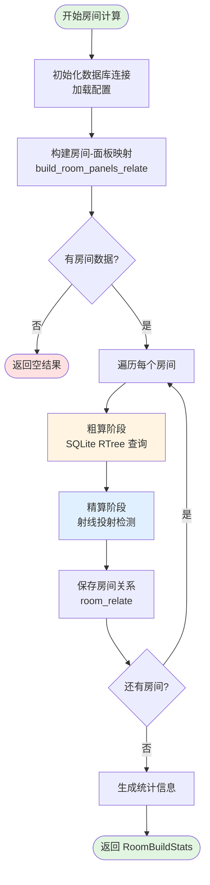
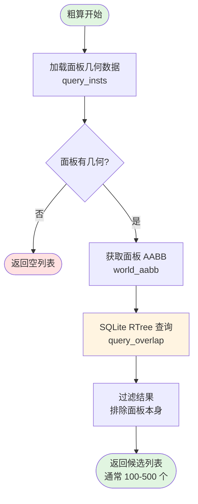
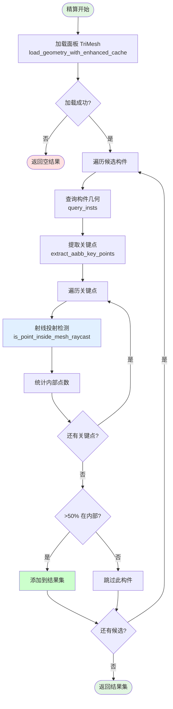
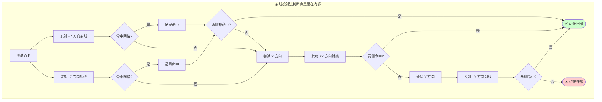
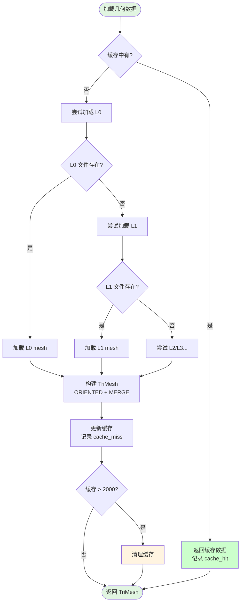
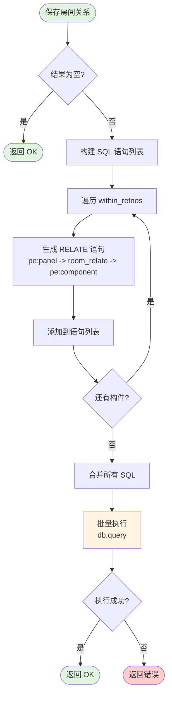
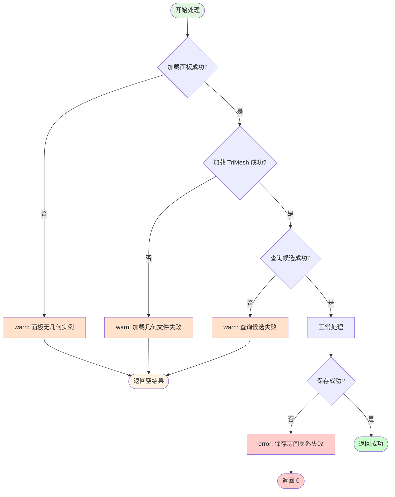
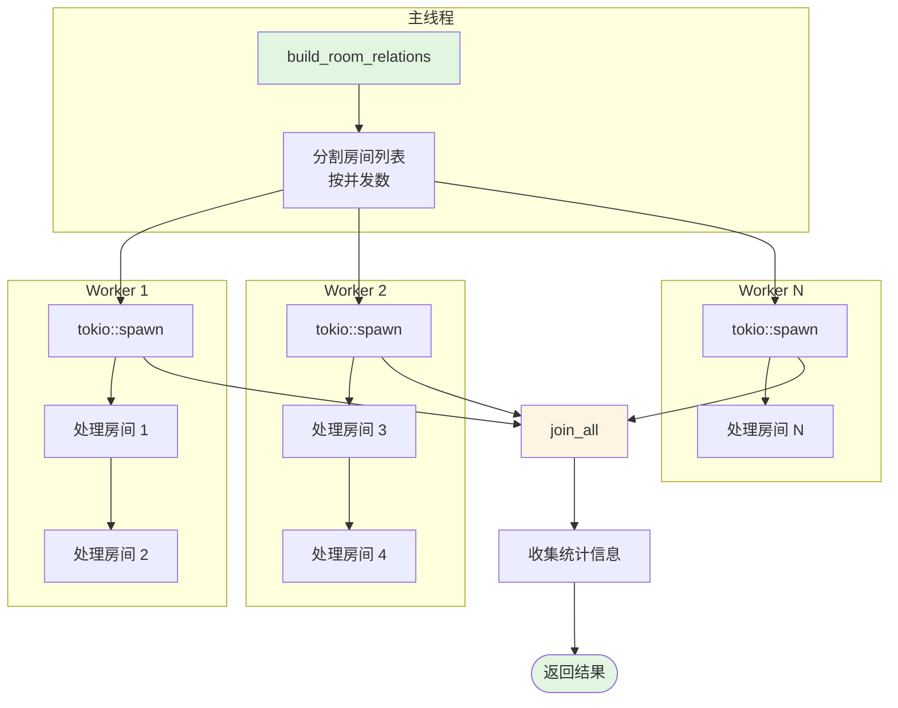

# 房间计算流程图

## 1. 整体架构流程



## 2. 粗算阶段详细流程



## 3. 精算阶段详细流程



## 4. 射线投射法原理



## 5. 几何数据加载流程



## 6. 房间-面板关系构建

```mermaid
flowchart TB
    Start([构建房间-面板映射]) --> QueryFRMW[查询所有 FRMW 节点<br/>按关键字过滤]

    QueryFRMW --> LoopFRMW[遍历每个 FRMW]
    LoopFRMW --> GetRoomNum[提取房间编号<br/>从 name 或 ESSION]

    GetRoomNum --> QueryPANE[递归查询子节点<br/>收集所有 PANE]

    QueryPANE --> SQL["SELECT array::flatten(<br/>@.{1..2+collect}.children<br/>)[?noun='PANE'].id"]

    SQL --> CheckPANE{有 PANE?}
    CheckPANE -->|否| NextFRMW{还有 FRMW?}
    CheckPANE -->|是| AddMap[添加到映射<br/>(room_num, panel_refno, panels)]

    AddMap --> NextFRMW
    NextFRMW -->|是| LoopFRMW
    NextFRMW -->|否| End([返回映射列表])

    style Start fill:#e1f5e1
    style End fill:#e1f5e1
    style SQL fill:#e1f0ff
```

## 7. 结果保存流程



## 8. 两阶段对比

```mermaid
graph TB
    subgraph "粗算 (Coarse)"
        C1[输入: 面板 AABB] --> C2[SQLite RTree]
        C2 --> C3[输出: 候选列表]
        C4[时间: O(log n + k)]
        C5[精度: 低 (仅 AABB)]
    end

    subgraph "精算 (Fine)"
        F1[输入: 候选 + TriMesh] --> F2[射线投射]
        F2 --> F3[输出: 确定列表]
        F4[时间: O(k × 27 × raycast)]
        F5[精度: 高 (几何精确)]
    end

    C3 -->|过滤| F1

    style C2 fill:#fff4e1
    style F2 fill:#e1f0ff
    style C5 fill:#ffcccc
    style F5 fill:#ccffcc
```

## 9. 错误处理流程



## 10. 并发处理架构


