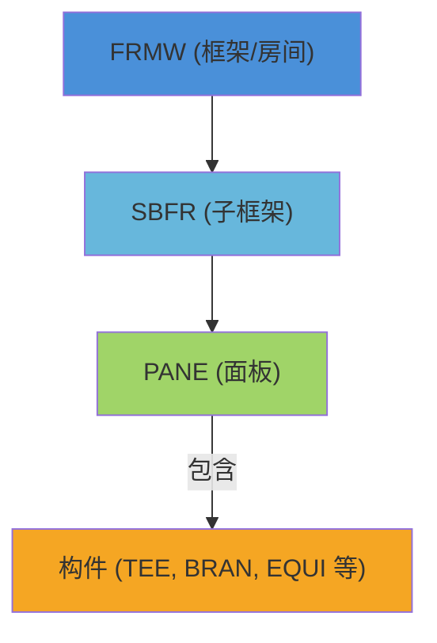
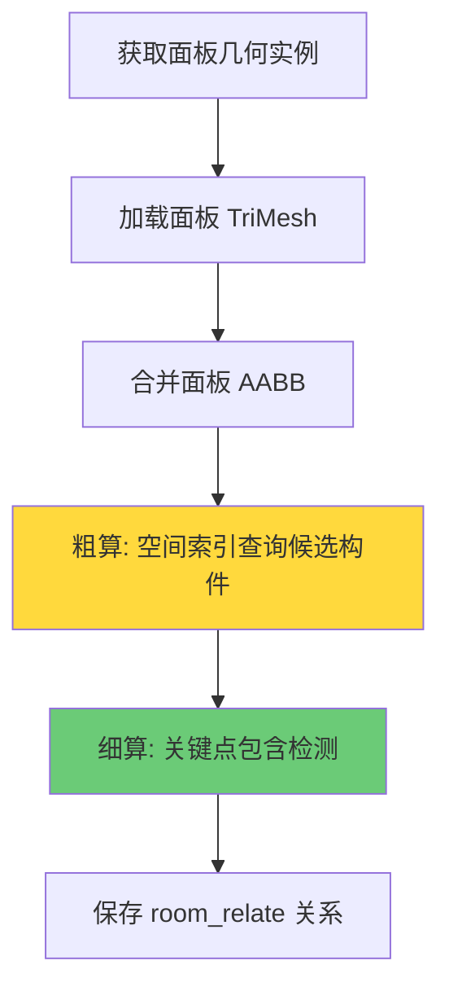

# 房间计算流程分析

本文档分析 `gen-model-fork` 项目中的房间计算逻辑，包括房间初始化、`belongs` 计算和房间模型生成的完整流程。

---

## 1. 整体架构

房间计算的核心代码位于 [room_model.rs](file:///Volumes/DPC/work/plant-code/gen-model-fork/src/fast_model/room_model.rs)。

### 1.1 数据结构层级



### 1.2 核心数据表

| 表名 | 作用 |
|------|------|
| `room_relate` | 存储房间面板(PANE)与构件的归属关系 |
| `room_panel_relate` | 存储房间(FRMW)与面板(PANE)的关系 |

---

## 2. 房间初始化流程

### 2.1 入口函数

房间关系构建的主入口是 [build_room_relations](file:///Volumes/DPC/work/plant-code/gen-model-fork/src/fast_model/room_model.rs#L180-L217)：

```rust
pub async fn build_room_relations(db_option: &DbOption) -> anyhow::Result<RoomBuildStats>
```

### 2.2 初始化步骤

1. **构建房间面板映射** (`build_room_panels_relate`)
   - 通过 SQL 查询 FRMW → SBFR → PANE 层级关系
   - 根据房间关键词过滤有效房间

2. **收集排除列表**
   - 收集所有房间面板的 refno，用于后续计算时排除

3. **计算房间关系** (`compute_room_relations`)
   - 并发处理每个房间
   - 对每个面板计算其包含的构件

4. **保存结果**
   - 将计算结果写入 `room_relate` 表

---

## 3. Belongs 计算逻辑

### 3.1 核心函数

[cal_room_refnos](file:///Volumes/DPC/work/plant-code/gen-model-fork/src/fast_model/room_model.rs#L502-L676) 计算哪些构件属于某个房间面板：

```rust
pub async fn cal_room_refnos(
    mesh_dir: &PathBuf,
    panel_refno: RefnoEnum,
    exclude_refnos: &HashSet<RefnoEnum>,
    inside_tol: f32,
) -> anyhow::Result<HashSet<RefnoEnum>>
```

### 3.2 计算流程



### 3.3 粗算阶段

使用 SQLite 空间索引查询与面板 AABB 重叠的候选构件：

```rust
let overlapping = sqlite::query_overlap(&panel_aabb, None, candidate_limit, &exclude_list)?;
```

### 3.4 细算阶段

对每个候选构件进行关键点检测：

1. **提取关键点** ([extract_geom_key_points](file:///Volumes/DPC/work/plant-code/gen-model-fork/src/fast_model/room_model.rs#L929-L960))
   
   **改进后的策略**（2024-12更新）：
   - **优先使用实际几何关键点**：从 `GeomInstQuery.pts` 字段获取
   - **回退使用 AABB 增强关键点**：如果 pts 为空
   - 始终添加 AABB 中心点以提高鲁棒性

   > [!NOTE]
   > 之前使用 AABB 的 27 个关键点会导致精度问题（特别是斜向管道、弯头等），现已改为使用几何体的实际关键点。

2. **投票判定** ([is_geom_in_panel](file:///Volumes/DPC/work/plant-code/gen-model-fork/src/fast_model/room_model.rs#L986-L1010))
   - 使用射线投射法判断点是否在网格内
   - **超过 50% 的关键点在面板内**即判定为属于该房间

3. **Mesh 顶点采样**（新增）
   - [extract_key_points_from_mesh](file:///Volumes/DPC/work/plant-code/gen-model-fork/src/fast_model/room_model.rs#L962-L984) 可从 TriMesh 顶点均匀采样
   - 始终包含质心点


### 3.5 射线投射法

[is_point_inside_mesh_raycast](file:///Volumes/DPC/work/plant-code/gen-model-fork/src/fast_model/room_model.rs#L1000-L1033) 向多个方向发射射线：

```rust
// 向 +Z 和 -Z 方向发射射线
let hit_pos_z = tri_mesh.cast_ray(&identity, &ray_pos_z, Real::MAX, true);
let hit_neg_z = tri_mesh.cast_ray(&identity, &ray_neg_z, Real::MAX, true);

// 如果 Z 方向两边都有交点，点在网格内部
if hit_pos_z.is_some() && hit_neg_z.is_some() {
    return true;
}
```

---

## 4. 房间模型生成

### 4.1 生成函数

[regenerate_room_models_by_keywords](file:///Volumes/DPC/work/plant-code/gen-model-fork/src/fast_model/room_model.rs#L1987-L2043) 用于根据房间关键词重新生成模型：

```rust
pub async fn regenerate_room_models_by_keywords(
    room_keywords: &Vec<String>,
    db_option: &DbOption,
    force_regenerate: bool,
) -> anyhow::Result<(usize, usize, u64)>
```

### 4.2 生成流程

1. **查询房间和面板关系** (`build_room_panels_relate`)
2. **收集所有需要生成的 refnos**
   - 面板本身
   - 房间内的所有构件
3. **调用模型生成函数** (`gen_all_geos_data`)

---

## 5. room_relate 表操作

### 5.1 保存关系

[save_room_relate](file:///Volumes/DPC/work/plant-code/gen-model-fork/src/fast_model/room_model.rs#L1036-L1069) 将计算结果写入数据库：

```sql
relate PE:panel_refno->room_relate:relation_id->PE:component_refno 
set room_num='A123', confidence=0.9, created_at=time::now();
```

### 5.2 表结构

| 字段 | 说明 |
|------|------|
| `in` | 房间面板 (PANE) 的 refno |
| `out` | 构件的 refno |
| `room_num` | 房间号 (如 "A123") |
| `confidence` | 置信度 (默认 0.9) |
| `created_at` | 创建时间 |

---

## 6. 增量更新

### 6.1 增量更新函数

[update_room_relations_incremental](file:///Volumes/DPC/work/plant-code/gen-model-fork/src/fast_model/room_model.rs#L1833-L1919) 只更新指定 refnos 相关的房间关系：

```rust
pub async fn update_room_relations_incremental(
    refnos: &[RefnoEnum],
) -> anyhow::Result<IncrementalUpdateResult>
```

### 6.2 增量更新流程

1. **查询受影响的面板** (`query_panels_containing_refnos`)
2. **删除旧关系** (`delete_room_relations_for_panels`)
3. **重新计算并保存新关系**

---

## 7. 房间计算开启条件

根据代码分析，房间计算的开启取决于：

1. **配置文件中的房间关键词** (`db_option.get_room_key_word()`)
2. **feature flag**: `sqlite-index` 和 `project_hd` / `project_hh`
3. **数据库中存在 FRMW 类型的房间节点**

### 7.1 项目特定配置

| Feature | 查询层级 | 房间名格式 |
|---------|----------|-----------|
| `project_hd` | FRMW → SBFR → PANE | `[A-Z]\d{3}` (如 A123) |
| `project_hh` | SBFR → PANE | 任意格式 |
| 默认 | FRMW → SBFR → PANE | 任意格式 |

---

## 8. 总结

房间计算的完整流程：

1. **初始化**：查询 FRMW → SBFR → PANE 层级，建立房间面板映射
2. **计算 belongs**：对每个面板，使用空间索引 + 关键点投票法确定哪些构件属于该房间
3. **保存关系**：将结果写入 `room_relate` 表
4. **模型生成**：如果开启房间计算，需要先生成所有房间相关的模型（面板 + 内部构件）

> [!IMPORTANT]
> 开启房间计算时，必须先执行 `build_room_relations` 构建房间关系，然后才能正确计算每个构件的 `belongs` 信息。
